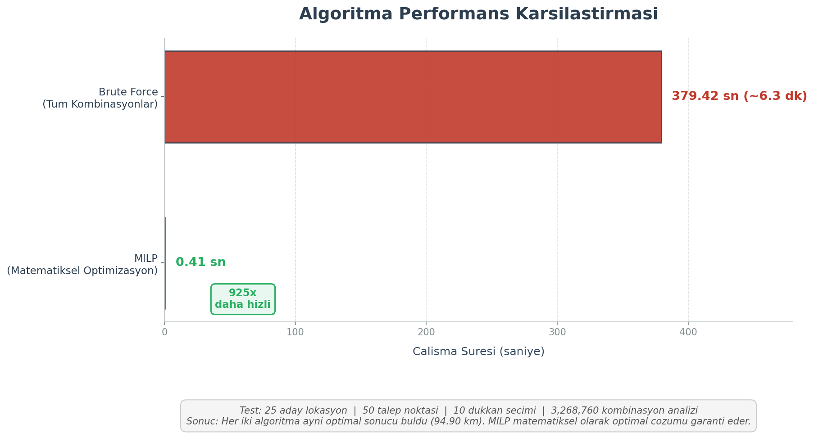

# Kullanım Kılavuzu

## Başlangıç

### Demo Erişimi

1. Tarayıcınızda adresi açın: https://optimal-konum-demo.onrender.com/
2. Demo Senaryoları bölümünden hazır bir senaryo seçin
3. "Yükle" butonuna tıklayın
4. Sonuçlar anında harita üzerinde görüntülenir

Demo senaryoları API key gerektirmez ve önceden hesaplanmıştır.

## Uygulama Kullanımı

### 1. Talep Noktalarının Eklenmesi

Talep noktaları, hizmet verilmesi gereken lokasyonlardır.

**Adımlar:**
1. Sol panelde "Talep Noktaları" arama kutusuna lokasyon adını yazın
2. Google Places otomatik tamamlama listesinden uygun sonucu seçin
3. Seçilen lokasyon haritada mavi nokta olarak işaretlenir
4. Maksimum 100 talep noktası eklenebilir

**Silme:** Liste öğesinin yanındaki X butonuna tıklayarak silebilirsiniz.

### 2. Aday Konumların Eklenmesi

Aday konumlar, tesis açılabilecek potansiyel yerlerdir.

**Adımlar:**
1. "Aday Konumlar" arama kutusuna lokasyon adını yazın
2. Otomatik tamamlama listesinden seçim yapın
3. Seçilen lokasyon haritada turuncu nokta olarak işaretlenir
4. Maksimum 15 aday konum eklenebilir

### 3. Tesis Sayısının Belirlenmesi

"Açılacak tesis sayısı" alanına istenen tesis sayısını girin.

**Not:** Tesis sayısı, aday konum sayısından fazla olamaz.

### 4. Optimizasyonun Çalıştırılması

"Optimize Et" butonuna tıklayın.

**İşlem Süreci:**
1. Google Maps API ile gerçek yol mesafeleri hesaplanır
2. MILP optimizasyon modeli çözülür 
3. Optimal konumlar haritada yeşil nokta olarak gösterilir
4. Her talep noktası, en yakın tesise yeşil çizgi ile bağlanır
5. Sol panelde detaylı sonuçlar listelenir

**Beklenen Süre:**
- 10-20 konum: 2-5 saniye
- 50+ konum: 5-10 saniye
- Demo senaryoları: Anında (önceden hesaplanmış)

## Sonuçların Yorumlanması

### Harita Gösterimi

**Renk Kodları:**
- Mavi: Talep noktaları
- Turuncu: Seçilmeyen aday konumlar
- Yeşil: Seçilen optimal tesisler
- Yeşil çizgi: Talep noktası-tesis bağlantıları

### Sonuç Paneli

Sol panelde her seçilen tesis için:
- Tesis adı ve adresi
- Bağlı talep noktalarının listesi
- Her bağlantının gerçek yol mesafesi (km)
- Toplam mesafe (matematiksel minimum değer)

## Sık Sorulan Sorular

**S: Sonuçlar ne kadar güvenilir?**

A: Sonuçlar MILP algoritması ile matematiksel olarak kanıtlanmış optimal çözümlerdir. Başka hiçbir kombinasyon daha iyi toplam mesafe sağlayamaz.

**S: Mesafeler nasıl hesaplanıyor?**

A: Google Maps Distance Matrix API kullanılarak gerçek araç yolu mesafeleri hesaplanmaktadır. Kuş uçuşu mesafe kullanılmamaktadır.

**S: API key olmadan kullanabilir miyim?**

A: Demo senaryoları API key gerektirmez. Kendi verilerinizi eklemek için Google Maps API key gereklidir.

**S: Kaynak kodlara nasıl erişebilirim?**

A: Kaynak kodlar kapalıdır. Basit bir versiyon için [önceki açık kaynak projeye](https://github.com/OsmanAydogan/istanbul_kahve_dukkanlari) bakabilirsiniz.

**S: Kapasite kısıtları dikkate alınıyor mu?**

A: Mevcut model sınırsız kapasite varsayımıyla çalışmaktadır. Her tesis tüm atanan talep noktalarına hizmet verebilir.

## Video Demonstrasyon

**[▶️ YouTube'da Tam Video İçin Tıklayın](https://youtu.be/xx4HxIuHZYA)**

## Performans Karşılaştırması

Grafik, MILP ve Brute Force yöntemlerinin performans karşılaştırmasını göstermektedir.

## Ek Dokümantasyon

- **[README.md](README.md)** - Proje genel tanıtımı
- **[Medium Makalesi](https://medium.com/@aydoganosman17/optimal-konum-planlay%C4%B1c%C4%B1-1a513b99f61a)** - Detaylı açıklama

---

**Demo URL:** https://optimal-konum-demo.onrender.com/
